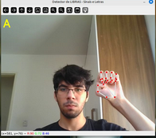
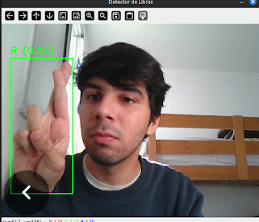
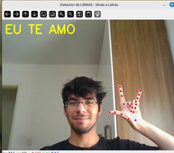

# DETECTOR DE LIBRAS!! Esse projeto tem o foco em detectar as libras (linguas brasileira de sinais) e fiz isso para treinar a minha maquina também para apresentar e aprender mais sobre machine learning. Utilizei PYTHON, OpenCv, YOLO e ultralytics. Fiquei muito alegre com o resultado!!

# ✋ DETECTOR DE LIBRAS

Esse projeto tem como foco detectar sinais da Língua Brasileira de Sinais (LIBRAS) utilizando visão computacional. Foi criado como parte dos meus estudos em **Machine Learning**, onde consegui treinar minha própria máquina com sucesso! Fiquei muito feliz com o resultado. 🤖✨

Utilizei:
- 🐍 **Python**
- 👁️ **OpenCV**
- 🚀 **YOLO** (You Only Look Once)
- 🔧 **Ultralytics** para facilitar o uso do modelo de detecção

---

## ⚙️ Imports principais

Certifique-se de ter os seguintes pacotes instalados:

```python
import cv2
from ultralytics import YOLO


### 📁 Dataset para o MACHINE LEARNING 

O modelo foi treinado utilizando o dataset “Alfabeto em Libras” 
disponível em Roboflow:

- 🧠 Classes: 22 (A–W, incluindo variações D1 e D2)
- 📂 Diretórios: `train`, `val`, e `test` (com as mesmas imagens, neste caso)
- 🔗 Dataset: [Alfabeto em Libras – Roboflow](https://universe.roboflow.com/elainesilva/alfabeto-em-libras-qrvnw/dataset/6)
- 📄 Licença: Creative Commons BY 4.0

O arquivo de configuração utilizado está nomeado como `data.yaml` e se encontra na raiz do projeto.

##### Se quiser experimentar mais sobre o Pipe hands pode acessar esse site: https://omes-va.com/contando-dedos-mediapipe-opencv-python/, aqui aprendi mais sobre os gestos, mas acabei retirando do projeto pois achei que consumia muito do computador e já não era tão necessário pois eu já havia treinado a maquina.

##### Espero que esse projeto possa agregar algo de positivo! Muito obrigado.

##### Alguns takes das LIBRAS funcionando :)




