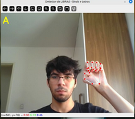
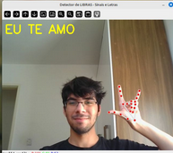
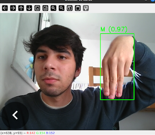
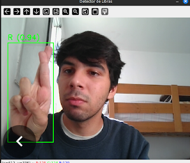

# Detector de Libras

---

Esse projeto tem como foco detectar sinais da Língua Brasileira de Sinais (**LIBRAS**) utilizando visão computacional. Foi criado como parte dos meus estudos em **Machine Learning.**

---

Essas imagens representam no incio onde eu mesmo programei os pontos dos dedos para fazer a letra A e o "eu te amo" e funcionou como deveria.

<p align="left">
  
  
</p>

---

## Tecnologias usadas

> **Python**
>
> **OpenCV** - captura da webcam, manipulação de frames e desenhos das caixas.
>
> **YOLOv8** - modelo de detecção em tempo real.
>
> **Ultralytics** - implementação prática do YOLO no python

---

### Funcionamento e Imports

*Requirements** 

```
  pip install -r requirements.txt

```

**Imports**

```
python
import cv2
from ultralytics import YOLO  # Ultralytics para validar as caixas com os gestos e ajustar os parâmetros

```

**Carregando o modelo YOLO**

```
model = YOLO("best.pt")

```

**Abrindo WebCam**

```
cap = cv2.VideoCapture(0)

```

**Detecção**

```
while True:
    ret, frame = cap.read()
    if not ret:
        break

    frame = cv2.flip(frame, 1)

    # Faz a predição com YOLO
    resultados = model.predict(source=frame, conf=0.5, verbose=False)

    # Itera sobre os resultados
    for r in resultados:
        for box in r.boxes:
            x1, y1, x2, y2 = map(int, box.xyxy[0])
            classe_id = int(box.cls[0])
            conf = float(box.conf[0])
            nome_classe = model.names[classe_id]

            # Desenha a caixa e escreve o texto
            cv2.rectangle(frame, (x1, y1), (x2, y2), (0, 255, 0), 2)
            texto = f"{nome_classe} ({conf:.2f})"
            cv2.putText(frame, texto, (x1, y1 - 10), cv2.FONT_HERSHEY_SIMPLEX,
                        0.8, (0, 255, 0), 2)

    cv2.imshow("Detector de Libras", frame)

    if cv2.waitKey(1) & 0xFF == ord('q'):
        break

```

**Finalizando**

```
cap.release()
cv2.destroyAllWindows()
```

---

Com o treinamento da máquina consegui alcançar uma detecção precisa.

<p align="left">
  
  
</p>

---

#### **Pesquisa e Fontes**

Para iniciar eu fiz uma pesquisa primeiro de como utilizar. Por sorte existe muitas documentações para se basearmos e auxilios nas redes para aprender como tudo funciona.

Em [https://dev.to/opendevufcg/script-para-abrir-webcam-com-python-utilizando-opencv-f26](https://dev.to/opendevufcg/script-para-abrir-webcam-com-python-utilizando-opencv-f26) te ensinam o básico do openCV e como configurar.

Em [https://docs.ultralytics.com/pt/models/yolo-world/#set-prompts](https://docs.ultralytics.com/pt/models/yolo-world/#set-prompts) sobre YOLO

Em [Alfabeto em Libras – Roboflow](https://universe.roboflow.com/elainesilva/alfabeto-em-libras-qrvnw/dataset/6) você encontra o dataset que utilzei para treinar a máquina.

---
